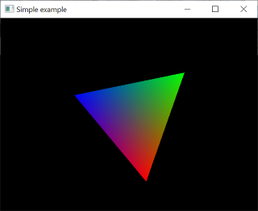

# 00_OpenWindow



## How to build

First, make a direcotry for **out-of-source build**
```bash
$ cd 00_OpenWindow
$ mkdir build
$ cd build
```

Then, if you put the `glfw` library under the `3rd_party/GLFW_Lib`, type   
```bash
cmake .. -DGLFW_ROOT=../3rd_party/GLFW_Lib
cmake --build .
```
Otherwise, you install the `glfw` using package manager, in such a case, simply type 

```bash
cmake .. 
cmake --build .
```


